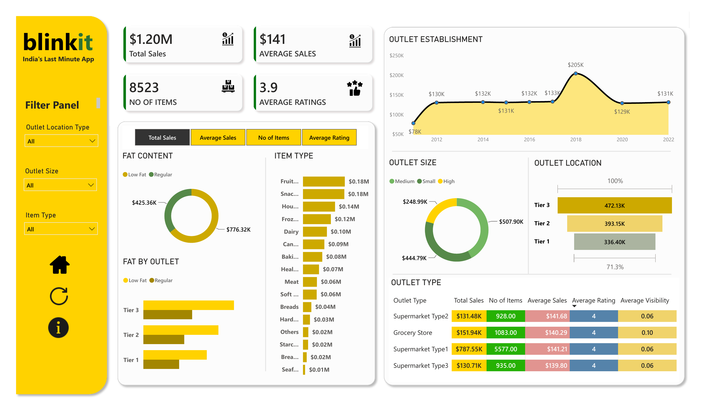

# 🛒 Blinkit Sales Analytics – Power BI Dashboard

A single-page **Power BI analytics dashboard** analyzing Blinkit's sales performance across outlet size, outlet type, outlet location tier, item category, and fat content.
This project turns 8,523 outlet-item sales records into an executive-ready dashboard with dynamic KPI switching, filterable panels, and category-level breakdowns.

---

## 📌 Project Overview

Blinkit ("India's Last Minute App") operates across outlets of varying size, type, and location tier, selling items across 16 product categories. Turning that transaction-level data into **decisions** — on outlet investment, product mix, and regional strategy — requires a structured analytics layer.
This dashboard consolidates that data into a single interactive view covering headline KPIs, item-type performance, fat-content mix, and outlet-level comparisons.

---

## 🎯 Business Objectives

- Track overall sales performance through headline KPIs (Total Sales, Average Sales, Items Sold, Average Rating)
- Identify top-selling item categories to guide product mix decisions
- Compare performance across Outlet Size (Small, Medium, High) and Outlet Location Tier (Tier 1, 2, 3)
- Analyze Fat Content mix (Low Fat vs. Regular) and how it varies by outlet tier
- Break down performance by Outlet Type (Grocery Store, Supermarket Type 1/2/3) for targeted strategy

---

## 📂 Dataset Overview

The dataset (`BlinkIT Grocery Data.xlsx`) is **item-level outlet sales data** covering 8,523 records. It includes:

- Item Type (Fruits & Vegetables, Snack Foods, Household, Frozen Foods, Dairy, Canned, Baking Goods, Health & Hygiene, Meat, Soft Drinks, Breads, Hard Drinks, Starchy Foods, Breakfast, Seafood, Others)
- Item Fat Content (Low Fat / Regular)
- Item Sales, Item Visibility
- Outlet Establishment Year (2012–2022)
- Outlet Size (Small, Medium, High)
- Outlet Location Type (Tier 1, Tier 2, Tier 3)
- Outlet Type (Grocery Store, Supermarket Type1, Type2, Type3)
- Customer/Outlet Rating

---

## 🧱 Dashboard Architecture

The report is built as a **single, densely-filterable page** with a persistent left-hand filter panel and a dynamic KPI-driven layout — rather than separate tabs, every visual on the page responds to one shared measure selector and one shared filter set.

**Filter Panel** (left rail)
- Outlet Location Type
- Outlet Size
- Item Type
- Home, Refresh, and Info action buttons

**Dynamic Measure Selector**
- A button-style toggle — Total Sales / Average Sales / No of Items / Average Rating — that drives the Fat Content donut and Item Type bar chart, so the same visuals can be read through four different lenses without adding extra charts

---

---

## 📊 Key Metrics Visualized

**Headline KPI Cards**
- Total Sales — **$1.20M**
- Average Sales — **$141**
- No of Items — **8,523**
- Average Ratings — **3.9**

**Outlet Establishment Trend** — Line/area chart of sales by the year outlets were established (2012–2022), spiking to **$205K around 2018** before settling back to the $129K–$131K range

**Fat Content** — Donut chart of Total Sales split by Low Fat vs. Regular, plus a secondary **Fat by Outlet** bar chart breaking that same split out across Tier 1, Tier 2, and Tier 3 outlets

**Item Type** — Horizontal bar chart ranking all 16 categories by sales, led by **Fruits & Vegetables ($0.18M)** and **Snack Foods ($0.18M)**, down to Seafood ($0.01M)

**Outlet Size** — Donut chart comparing Medium, Small, and High-size outlets

**Outlet Location** — Bar chart comparing Tier 1, Tier 2, and Tier 3 outlet sales, led by **Tier 3 (472.13K)**

**Outlet Type Table** — Matrix comparing Supermarket Type1/2/3 and Grocery Store across Total Sales, No of Items, Average Sales, Average Rating, and Average Visibility — **Supermarket Type1** leads by a wide margin at **$787.55K in sales and 5,577 items sold**

---

## 🔑 Key Insights

- **Medium-sized outlets** generate the highest total sales among the three outlet-size categories
- **Tier 3 locations** outperform Tier 1 and Tier 2 on total sales, despite the "lower tier" label
- **Low Fat products** make up the larger share of total sales, consistent with health-conscious buying trends
- **Fruits & Vegetables and Snack Foods** are the top-performing item categories, each contributing $0.18M
- **Supermarket Type1** is by far the strongest outlet type, generating over 6x the sales of any other single outlet type despite similar average sales-per-item and rating figures — pointing to volume/footprint rather than pricing as the driver
- Outlet establishment year shows a sales spike for outlets opened around **2018**, with earlier and later cohorts performing more consistently in the $129K–$133K band

---

## 🛠 Tools & Technologies Used

- **Microsoft Power BI Desktop**
- **DAX (Data Analysis Expressions)** — KPI measures, dynamic measure-selector logic
- **Power Query** — data cleaning and transformation of the raw grocery dataset
- Data Modeling — item, outlet, and sales fields consolidated into a single analytical table
- KPI Card Design, Donut/Bar/Line Charts, Matrix Table, Slicer-driven Filter Panel

---

## 📈 Power BI Skills Demonstrated

- Building a dynamic measure selector to let one set of visuals answer four different questions
- Designing a dense, single-page executive dashboard without sacrificing readability
- DAX-driven KPI cards and matrix table calculations (Total Sales, Average Sales, Average Rating, Average Visibility)
- Data cleaning and transformation of real-world retail data using Power Query
- Business Intelligence storytelling for retail/quick-commerce analytics

---

## 📈 Business Impact

This dashboard enables Blinkit's management and analysts to:

- Identify which outlet sizes and location tiers are driving the most revenue
- Optimize product mix using item-type and fat-content performance data
- Flag high-performing outlet types (like Supermarket Type1) as models for expansion
- Support pricing, inventory, and marketing decisions with a single, filterable source of truth

---

## 🚀 Future Enhancements

- Break the single page out into multiple focused views (Overview / Outlet Analysis / Item Analysis)
- Add drill-through from outlet-type or item-type visuals to record-level detail
- Add time-based trend analysis beyond outlet establishment year
- Predictive sales forecasting by outlet type and item category

---

📌 GitHub Repository:
<https://github.com/whoisaustin7/Blinkit_dasboard>

---

## 📎 Note

This project uses `BlinkIT Grocery Data.xlsx` as the source dataset, with the dashboard exported as `BLINKIT ANALYTICS 2026.pdf`. Power Query and DAX were used for all data cleaning, modeling, and KPI calculations in Power BI Desktop.
